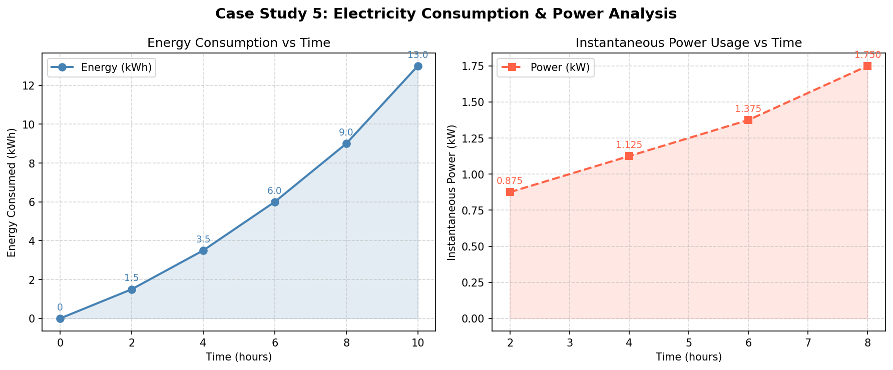

# CompSci-Finals-Activity1-GROUP_2_GULENG-HADJINOR-RICO

# Case Study 3: Diffusion Process Simulation (Heat Spread)

## Overview
A metal rod is heated at one end. Engineers want to estimate how heat spreads along the rod over time using discrete 
measurements. 

Computatinal Task
- Approximate temperature gradient (derivative) 
- Estimate total heat distribution (integration) 
- Analyze di usion behavior
  
## Given Data

| Position (cm) | Temperature (°C)  |
|:---:|:---:|
| 0 | 100 |
| 2 | 80 |
| 4 | 65 |
| 6 | 55 |
| 8 | 48 |
| 10 | 45 |

The methods used include the central difference method for derivatives and Simpson’s Rule (with trapezoidal correction) for integration.

# SUMMARY OF RESULTS

## Temperature Gradient
| Position (cm) | dT/dx (°C/cm))  |
|:---:|:---:|
| 2 | -8.75 |
| 4 | -6.25 |
| 6 | -4.25 |
| 8 | -2.50 |

The gradient is negative at all points, indicating that temperature decreases as distance from the heat source increases.

## Total Heat Distribution
The total heat along the rod (from 0 cm to 10 cm) was approximated as:
TOTAL HEAT ≈ 638.33
This value represents the area under the temperature curve, indicating the overall thermal energy distribution.

## Graphical Interpretation
Two graphs were generated:

# Temperature vs Position
Shows a decreasing curve that gradually flattens


# Gradient vs Position
Shows decreasing magnitude of slope as distance increases


These graphs visually confirm the numerical findings.

## Analysis of Heat Diffusion Behavior
1. Where is heat transfer fastest?
Heat transfer (in this simplified interpretation) is fastest where the magnitude of the gradient |dT/dx| is largest.
From the computed gradient values:
At x = 2 cm,
dT/dx≈−8.75 °C/cm
This is the largest magnitude gradient among the interior points, indicating the steepest temperature drop.
Therefore, heat transfer is fastest near the heated end, particularly around 2 cm, and likely even closer to 0 cm (though endpoint gradients were not computed).

2. Does temperature decrease linearly?
No, the temperature does not decrease linearly.
If the temperature profile were linear:
•	The gradient would remain constant
However, the computed gradients show:
−8.75→−6.25→−4.25→−2.50
This clearly indicates:
•	The slope is changing
•	The curve is nonlinear
The temperature profile flattens as distance increases, which is characteristic of diffusion processes.

3. What happens farther from the heat source?
As we move farther from the heat source (toward 10 cm), the temperature decreases more gradually, causing the curve to flatten and the magnitude of the gradient to decrease. This indicates that the temperature becomes less sensitive to changes in position and that heat transfer slows down. Such behavior is consistent with diffusion phenomena, where the influence of the heat source weakens as the distance increases.

## Conclusion

The numerical analysis shows that heat transfer is strongest near the source and gradually weakens along the rod, the temperature distribution is nonlinear rather than uniform, and the system follows typical diffusion behavior in which temperature gradients decrease with distance, while numerical methods such as the central difference and Simpson’s Rule prove to be effective tools for analyzing physical systems using discrete data.


# Case Study 5: Electricity Consumption and Power Analysis

## Overview
A household records electric energy consumption (kWh) at different times of the day. Using only these discrete data points, we apply two numerical methods to analyze electricity usage:

- **Numerical Differentiation** — instantaneous power usage (rate of change)
- **Numerical Integration** — total energy consumed over time

## Given Data

| Time (hours) | Energy (kWh) |
|:---:|:---:|
| 0 | 0 |
| 2 | 1.5 |
| 4 | 3.5 |
| 6 | 6.0 |
| 8 | 9.0 |
| 10 | 13.0 |

> Step size: **h = 2 hours**

## Solution Approach

### Step 1 — Numerical Differentiation (Central Difference)

Power is the rate of change of energy with respect to time:

```
P(t) = dE/dt
```

Since we only have discrete data points (not a continuous function), we estimate power using the **Central Difference Formula**:

```
P(t) = [ E(t + h) - E(t - h) ] / (2 * h)
```

---

### Step 2 — Numerical Integration (Trapezoidal Rule)

To estimate the total area under the Energy vs. Time curve, we use the **Trapezoidal Rule**. This method connects each pair of data points with a straight line, forming trapezoid-shaped strips, and sums their areas.

**Single strip area:**
```
Area = (E(t0) + E(t1)) / 2 * h
```

**Full formula (shortcut):**
```
Total = (h/2) * [ E(0) + 2*E(2) + 2*E(4) + 2*E(6) + 2*E(8) + E(10) ]
```

> The middle values are multiplied by 2 because each interior point is shared between two neighboring strips — it acts as the right edge of one strip and the left edge of the next. Only the first and last points belong to a single strip, so they remain as-is.

We also apply the trapezoidal rule on the computed **P(t) values** to verify that the integral of power approximates total energy = 13 kWh.

---

## Expected Results

### Power Table (Step 1)

| Time (hrs) | E(t+h) | E(t-h) | Numerator | Denominator (2h) | Power (kW) |
|:---:|:---:|:---:|:---:|:---:|:---:|
| 2 | 3.5 | 0.0 | 3.5 | 4 | **0.875** |
| 4 | 6.0 | 1.5 | 4.5 | 4 | **1.125** |
| 6 | 9.0 | 3.5 | 5.5 | 4 | **1.375** |
| 8 | 13.0 | 6.0 | 7.0 | 4 | **1.750** |

---

### Integration Results (Step 2)

**Trapezoidal Rule on E(t):**

| Strip | Time Range | Calculation | Area (kWh·hr) |
|:---:|:---:|:---:|:---:|
| 1 | t = 0 → 2 | (0 + 1.5) / 2 × 2 | 1.50 |
| 2 | t = 2 → 4 | (1.5 + 3.5) / 2 × 2 | 5.00 |
| 3 | t = 4 → 6 | (3.5 + 6.0) / 2 × 2 | 9.50 |
| 4 | t = 6 → 8 | (6.0 + 9.0) / 2 × 2 | 15.00 |
| 5 | t = 8 → 10 | (9.0 + 13.0) / 2 × 2 | 22.00 |
| **Total** | | | **53.00 kWh·hr** |

**Trapezoidal Rule on P(t) (verification):**

```
= (2/2) * [ 0.875 + 2(1.125) + 2(1.375) + 1.750 ]
= 1 * [ 0.875 + 2.25 + 2.75 + 1.750 ]
= 7.625 kWh
```

> This does not perfectly equal 13 kWh. This is an expected limitation — since central difference cannot compute power at t = 0 and t = 10, those boundary contributions are missing from the integration, reducing the accuracy of the result.

---

## Analysis

| Question | Answer |
|---|---|
| When is electricity usage highest? | At **t = 8 hrs** with 1.750 kW, and still rising toward t = 10 |
| Is consumption steady or increasing? | **Accelerating** — power doubles from 0.875 to 1.750 kW over the period |
| Is the pattern linear or non-linear? | **Non-linear** — the energy curve bends upward, confirming accelerating growth |

**Suggestions to reduce peak usage:**
- Shift heavy appliances (washer, oven, dishwasher) to earlier hours (t = 0–4) when power usage is lowest
- Use smart timers or home automation to distribute energy load more evenly
- Install solar panels to offset rising energy demand in later hours
- Upgrade to energy-efficient appliances that draw less power during peak periods

---

## Graphs

- **Energy vs Time** — shows how total energy consumption grows over the 10-hour period
- **Power vs Time** — shows instantaneous power at each computed interior point


